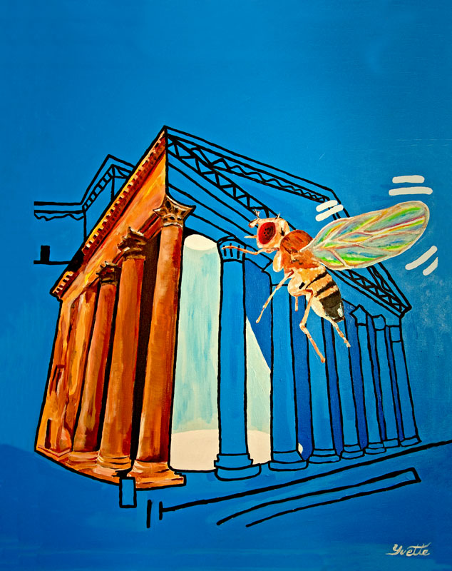

# Cover art
[About](https://evettita.github.io) | [Publications](https://evettita.github.io/publications) | [Art](https://evettita.github.io/coverart)

I enjoy creating cover painting to accompany publications, one of these days I would be excited to get selected for the cover.

## Orientation selectivity sharpens motion detection 

We found that peripheral motion detecting circuits in Drosophila melanogaster display orientation selectivity for static visual features that is orthogonal to their preferred axis of motion. This coincident extraction of orientation and motion sharpens directional tuning and reveals a striking parallel between visual processing in flies and vertebrate cortex, suggesting a universal strategy for motion processing.  The painting depicts this functional commonality in the movement of a fly through a visual scene designed by humans. Inspired by British pop artist Patrick Caulfield, the painting depicts the sharp horizontal and vertical architectural features surrounding the great oculus (eye) of the Roman Pantheon.  This artistic interpretation portrays how orientation-selective circuitry serves to accentuate prominent contours and edges while the fruit fly navigates the scene. 

## Modular use of peripheral input channels tunes motion-detecting circuitry.

Silies et al. identified a novel input to motion detecting circuitry
in the fruit fly. The study shows that this novel input acts combinatorially with two
previously known inputs, to inform circuits specialized to detect moving light and dark
edges. Fruit flies have several innate behavioral responses to visual motion. Different
subsets of input channels are required for these various behaviors. These findings
support a circuit architecture where information in the nervous system "flows" through
multiple pathways that diverge and converge, ultimately feeding into distinct output
streams. This parallels the cascade of water down a waterfall, and is here illustrated in a
painting, where water flows out of the first optic neuropil of the fly, the lamina, and splits
into distinct pathways that get recombined to finally feed into separate streams.

