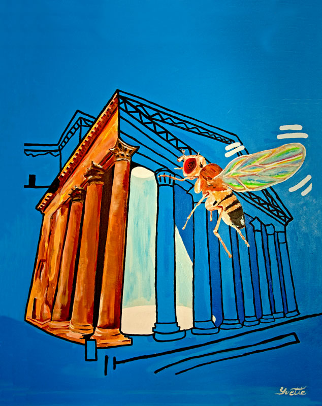
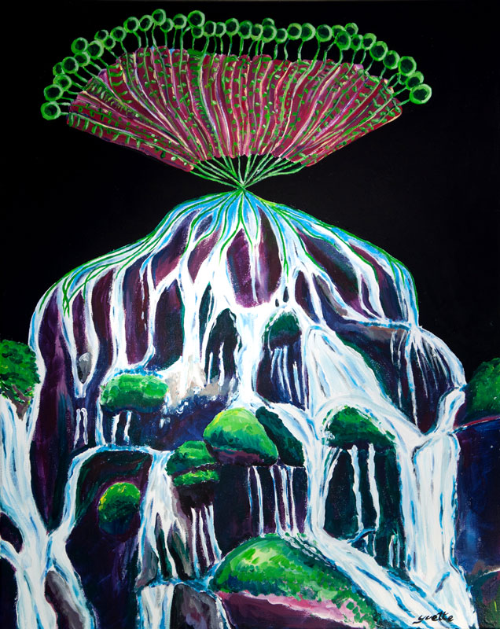

# Cover art
submitted cover art

## Orientation selectivity sharpens motion detection 

We found that peripheral motion detecting circuits in Drosophila melanogaster display orientation selectivity for static visual features that is orthogonal to their preferred axis of motion.  This coincident extraction of orientation and motion sharpens directional tuning and reveals a striking parallel between visual processing in flies and vertebrate cortex, suggesting a universal strategy for motion processing.  The painting depicts this functional commonality in the movement of a fly through a visual scene designed by humans.  Inspired by British pop artist Patrick Caulfield, the painting depicts the sharp horizontal and vertical architectural features surrounding the great oculus (eye) of the Roman Pantheon.  This artistic interpretation portrays how orientation-selective circuitry serves to accentuate prominent contours and edges while the fruit fly navigates the scene. 

