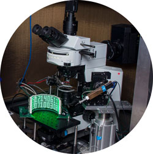

# News
[About](https://evettita.github.io) | [News](https://evettita.github.io/news) | [Publications](https://evettita.github.io/publications) | [Resources](https://evettita.github.io/resources) | [Art](https://evettita.github.io/coverart) | [CV](images/CV_Yvette_Fisher_2018_April.pdf)

 

July 2019  – Another great year for the "[Fly Module]" (https://www.mbl.edu/nsb/about/flyflight/) at Woods Hole.

October 2018 - Exciting to co-organize and share my latest research at [Structure and Function of the Insect Central Complex ](https://www.janelia.org/you-janelia/conferences/structure-and-function-of-the-insect-central-complex) meeting at Janelia!

Summer 2018  – Taught in the "Fly Module" of the [Neural Systems and Behavior course](https://www.mbl.edu/nsb/about/flyflight/) at Woods Hole.

March 2018  – FlpStop aids in the Williams lab’s beautiful [study](https://elifesciences.org/articles/31659) of neurexin and neuroligin function in axon growth.

Sept 2017 – Honored to be part of the inaugural class of [Hanna Gray Fellows](https://www.hhmi.org/news/hhmi-selects-15-hanna-gray-fellows-support-diversity-science#)! 
Video [evidence](https://www.youtube.com/watch?time_continue=2&v=lThCxILtl3w) that I think “science is hard”.

July 2017 – a [review chapter](https://link.springer.com/chapter/10.1007%2F978-3-319-57363-2_15) that I wrote with Tom Clandinin about the application of genetic tools to circuit dissection is published.

March 2017 – FlpStop tool receives a [shout out](https://science.sciencemag.org/content/355/6332/1387.4) in Science magazine

February 2017 – Our [FlpStop paper](https://elifesciences.org/articles/22279) is published!

June 2016 – Moved to Boston to start a Postdoc in the [Wilson 
Lab](https://wilson.hms.harvard.edu/)!
