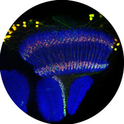
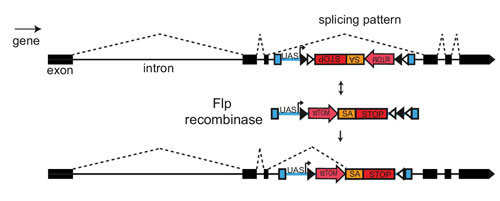
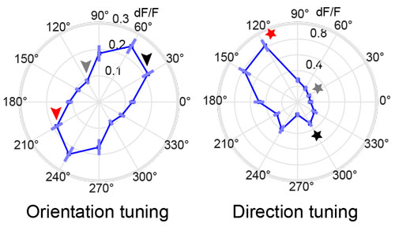
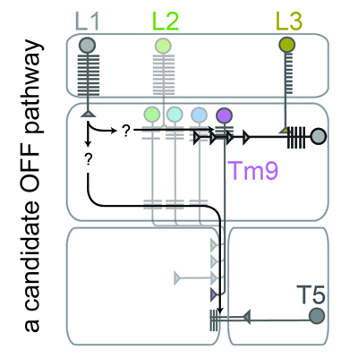

# Publications
[About](https://evettita.github.io) | [News](https://evettita.github.io/news) | [Publications](https://evettita.github.io/publications) | [Resources](https://evettita.github.io/resources) | [Art](https://evettita.github.io/coverart) | [CV](images/CV_Yvette_Fisher_2018_April.pdf){:target="_blank"}

 

full publication [list](https://scholar.google.com/citations?user=-huQ4SMAAAAJ&hl=en) on google scholar

# Selected Publications

## FlpStop, a tool for conditional gene control in Drosophila

**Fisher, Y. E.**\*, Yang, H. H.\*, Isaacman-Beck, J., Xie, M., Gohl, D. M., Clandinin, T. R. (2017). ELife 6: e22279 
\* equal contributions ([link](https://elifesciences.org/articles/22279))

 
We developed an improved transgenic tool kit called FlpStop that provides a facile and generalizable means to create conditional alleles that can be turned ON or OFF in any cell type of interest.

Highlighted in Science [Editors' Choice](http://science.sciencemag.org/content/355/6332/twil#compilation-1-4-article-title-1)

## Orientation selectivity sharpens motion detection in Drosophila

**Fisher, Y. E.**\*, Silies, M.*, Clandinin, T. R. (2015). Neuron 88 (390-402) \* equal contributions ([link](http://www.sciencedirect.com/science/article/pii/S0896627315008223))

 

Detecting the orientation and movement of visual edges is critical to visually-guided behaviors. We found that motion detecting circuits in Drosophila amplify signals in the preferred direction. These same neurons respond selectively to static features that are oriented orthogonal to their preferred direction of motion. This coincident extraction of orientation and direction sharpens directional tuning and reveals a striking parallel between visual processing in flies and the primary visual cortex of vertebrates, suggesting a universal strategy for motion processing.

## A Class of Visual Neurons with Wide-Field Properties Is Required for Local Motion Detection

**Fisher, Y. E.**\*, Leong, J. C. S.\*, Sporar, K., Ketkar, M. D., Gohl, D. M., Clandinin, T. R., Silies, M. (2015). Current Biology 25(3178-3189) * equal contributions ([link](http://www.cell.com/current-biology/abstract/S0960-9822(15)01412-8))

 

Visual motion processing in Drosophila occurs in parallel ON and OFF channels. In this study, we identified the interneuron Tm9 as a critical component of the OFF pathway. Tm9 is required for behavioral responses to OFF moving edges, and silencing Tm9 disrupts motion signals in the downstream motion sensitive neurons. Interestingly, these neurons have very wide receptive fields, a property not predicted by current models. In addition, excitatory signals from both ON and OFF upstream channels converge on Tm9, suggesting that ON and OFF pathways are not cleanly separable.

## Full Publication list
15)**Fisher, Y. E.**, Lu, J. D’Alessandro, I. Wilson, R. I. (2019) Sensorimotor experience remaps visual input to a heading direction network.  Nature. In press

14)Isaacman-Back, J. Paik, K. C., Wienecke, C. F. R., Yang, H. H., **Fisher, Y. E.**, Wang, I. E., Ishida, I. G. Maimon, G. Wilson, R. I. Clandinin, T. R.  (2019) SPARC: a method to genetically manipulate precise proportions of cells.  BioRxiv doi: 10.1101/788679

13)Constance, W. D., Mukherjee, A., **Fisher, Y. E.**, Pop, S. Blanc, E., Toyama, Y., Wiliams, D. W. (2018) Neurexin and Neuroligin-based adhesion complexes drive axonal arborisation. ELife 7:e31659. 

12)**Fisher, Y. E.** & Clandinin, T.R. (2017) Chapter 15: Combining Anatomy, Measurement and Manipulation of Neuronal Activity to Interrogate Circuit Function in Drosophila. In M. F. Wernet & A. Çelik (Eds.)  Decoding Neural Circuit Structure and Function (pp. 371-391). Springer. 10.1007/978-3-319-57363-2. 

11)**Fisher, Y. E.**\*, Yang, H. H.\*, Isaacman-Beck, J., Xie, M., Gohl, D. M., Clandinin, T. R. (2017) FlpStop, a tool for  conditional gene control in Drosophila. ELife 6: e22279  * equal contributions 
	 Research Highlight in Science “Editor’s Choice” 355, 6332 (1387-1388)
   
10)**Fisher, Y. E.**\*, Leong, J. C. S.\*, Sporar, K., Ketkar, M. D., Gohl, D. M., Clandinin, T. R., Silies, M. (2015) A Class of Visual Neurons with Wide-Field Properties Is Required for Local Motion Detection. Current Biology 25(3178-3189)  * equal contributions

9)**Fisher, Y. E.**\*, Silies, M.\*, Clandinin, T. R. (2015) Orientation Selectivity Sharpens Motion Detection in Drosophila.  Neuron 88 (390-402)  * equal contributions

8)Holley, S., Joshi, P., Parievsky, A. Galvan, L., Chen, J., **Fisher, Y. E.**, Huynh, M., Cepeda, C., Levine, M. (2015) Enhanced GABAergic Inputs Contribute to Functional Alterations of Cholinergic Interneurons in the R6/2 Mouse Model of Huntington’s Disease. eNeuro 2015 10.1523

7)Esch, J.J., **Fisher, Y. E.**, Leong, J.C.S, Clandinin, T.R., (2015) Chapter 12: Genetic Pathways to Circuit Understanding in Drosophila. Neural Tracing Methods, Tracing Neurons and Their connections, 92(249-274)

6)Silies, M. S.\* Gohl, D.\*, **Fisher, Y. E.**, Freifeld, L., Clark, D., Clandinin, T. (2013) Modular Use of Peripheral Input Channels Tunes Motion-Detecting Circuitry. Neuron, 79(1), 111–12  * equal contribution
  
5)Andre, V. M., **Fisher, Y. E.**, Levine, M. S. (2011) Altered balance of activity in the striatal direct and indirect pathways in mouse models of Huntington’s disease. Frontiers in Systems Neurosci.  5(46)

4)Andre, V. M., Cepeda, C., **Fisher, Y. E.**, Huynh, M. Bardakjian, N. Singh, S. Yang, X. W. Levine, M. (2011) Differential electrophysiological changes in striatal output neurons in Huntington's disease. J. Neurosci, 31(4):1170–1182.

3)Cummings, D. M., Andre, V. M., Uzgil, B. O., Gee, S. M., **Fisher, Y. E.**, Cepeda, C., Levine, M. S. (2009) Alterations in Cortical Excitation and Inhibition in Genetic Mouse Models of Huntington’s Disease. J.Neurosci, 29 (33)10371-86

2)Andre, V., Cepeda, C., Cummings, D., Jocoy, E., **Fisher, Y. E.**, Yang, W., Levine M. S. (2009) Dopamine Modulation of Excitatory Currents in Striatum is Dictated by the Expression of D1 or D2 Receptors and Modified by Endocannabinoids, Eur. J. of Neurosci. 31(1) 14-28

1)**Fisher, Y. E.**, Andre, V., Cepeda, C., Levine, M. (2008) Dopamine-glutamate interactions at the forefront of schizophrenia research, Cell Science Reviews, Vol 5 No 1.
