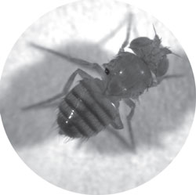

# Resources
[About](https://evettita.github.io) | [News](https://evettita.github.io/news) | [Publications](https://evettita.github.io/publications) | [Resources](https://evettita.github.io/resources) | [Art](https://evettita.github.io/coverart) | [CV](images/CV_Yvette_Fisher_2018_April.pdf){:target="_blank"}

 

## FlpStop reagents
FlpStop plasmids are available from [addgene](https://www.addgene.org/browse/article/25565/)

 

FlpStop fly strains are available from [BDSC](https://bdsc.indiana.edu/).  Here is a [list](http://flybase.org/hitlist/FBtp0116718/to/FBti#/page/1) from FlyBase of all of the available strains

Please [contact me](https://evettita.github.io) if you have any questions about using these reagents!

