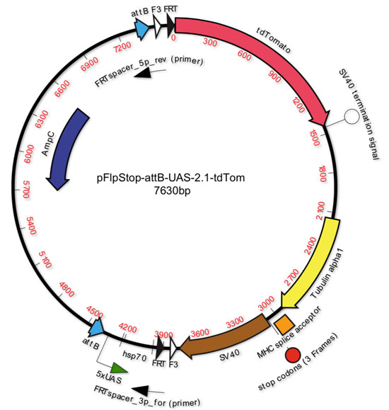

# Resources

 

## FlpStop reagents
 

FlpStop plasmids are available from [addgene](https://www.addgene.org/browse/article/25565/)

FlpStop fly strains are available from [BDSC](https://bdsc.indiana.edu/).  Here is a [list](http://flybase.org/hitlist/FBtp0116718/to/FBti#/page/1) from FlyBase of all of the available strains

Feel free to [contact me](https://evettita.github.io) if you have any questions about using these reagents!

##Other resourses

